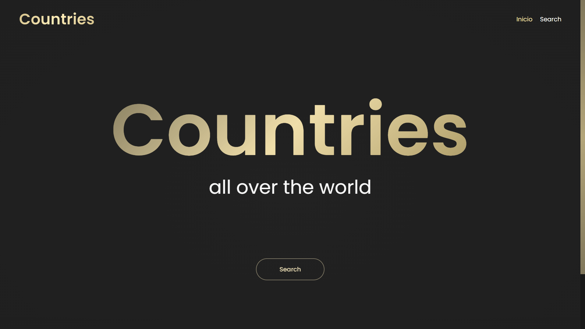
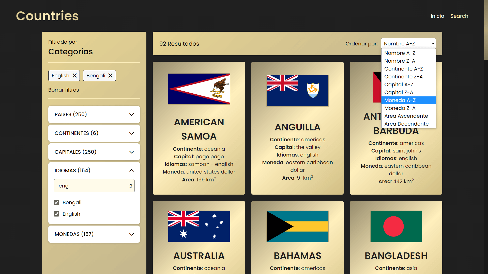
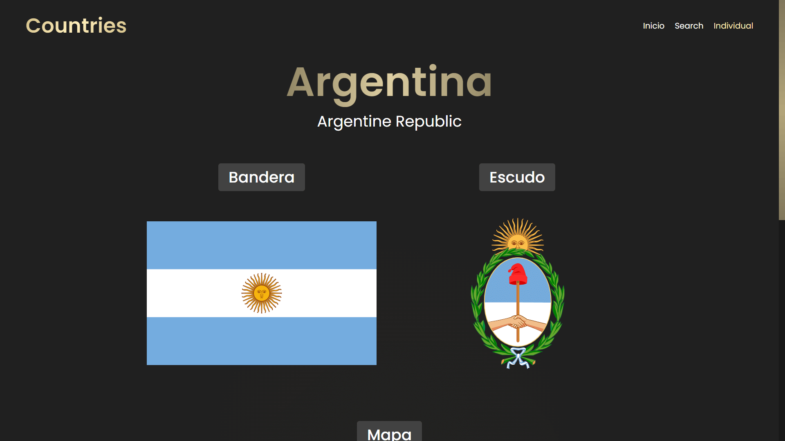
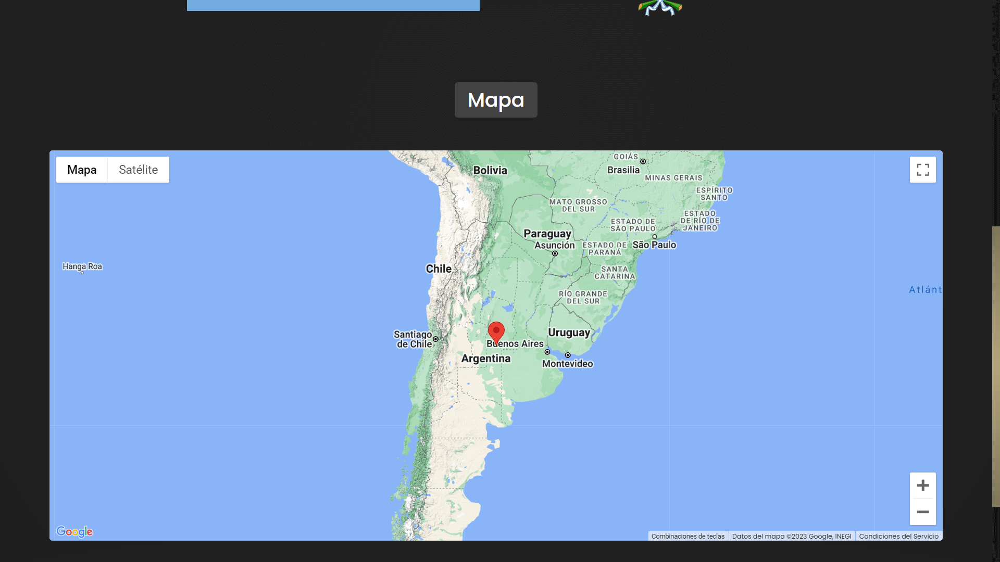
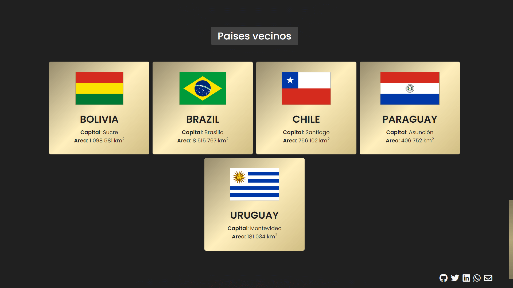

# Crountries

Application that provides country information

## 📷 Screenshots

## ⚙️ state of development
In progress, you can test the beta version [Here](https://countries-jaenfigueroa.netlify.app/inicio)
